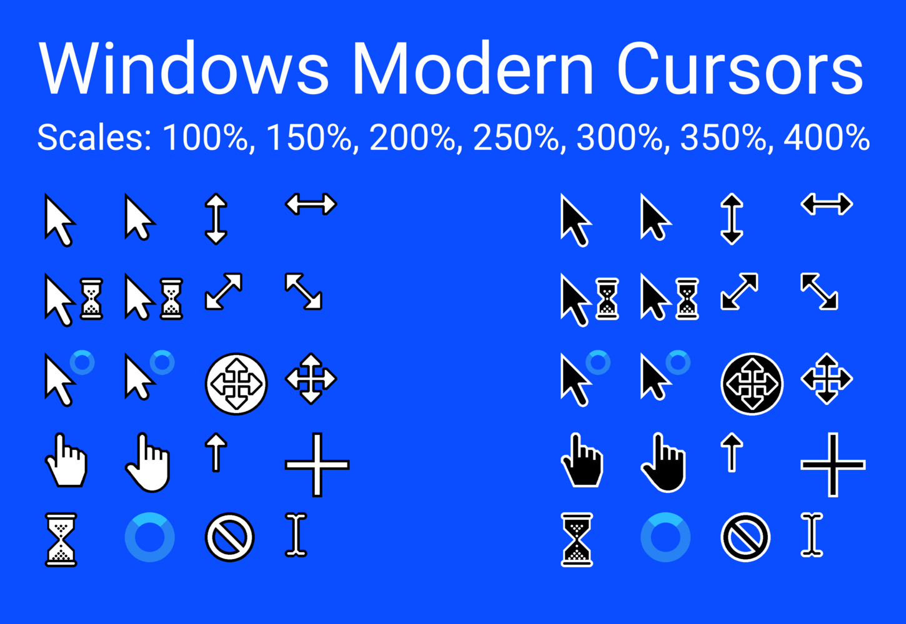
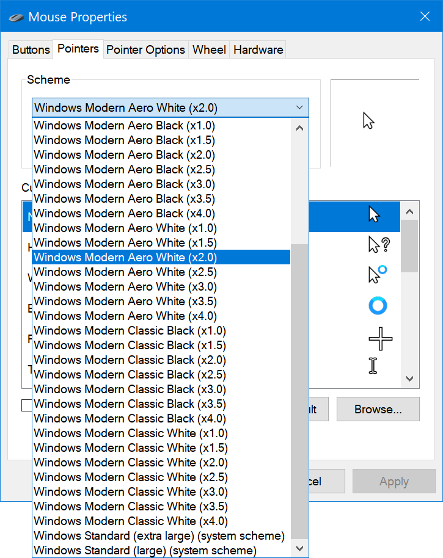

# Windows Modern Cursors

Remake of the classic and aero cursors from Microsoft Windows

**INFO**: An updated release is currently in the works.

# Installation

1. Navigate to the [Releases](https://github.com/oxou/windows-modern-cursors/releases) page
2. Download the latest 7z archive and extract it
3. Read the further instructions inside `readme.txt`

